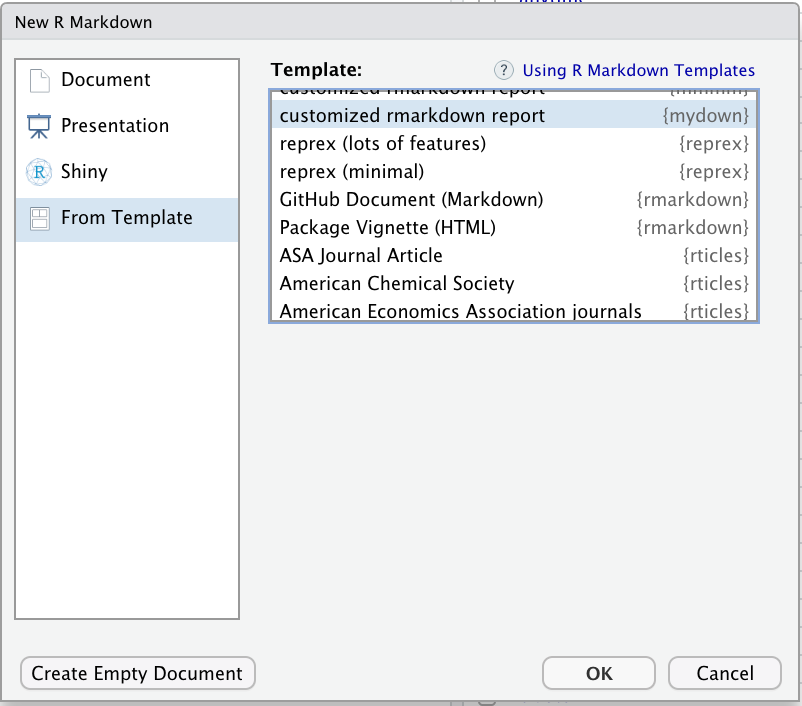

```{r, include = FALSE}
knitr::opts_chunk$set(
  collapse = TRUE,
  comment = "#>"
)
```

indiedown makes it easy to generate a customized R Markdown PDF template that follow the principles of your corporate design.

Start by installing indiedown:

```{r eval = FALSE}
install.packages("indiedown")
```

You can also install the development version from GitHub:

```{r eval = FALSE}
# install.packages("remotes")
remotes::install_github("cynkra/indiedown")
```

## Create an customized R Markdown template

```{r eval = FALSE}
# install.packages("devtools")
devtools::install_github("cynkra/indiedown")
```

To create your own customized R Markdown template, start by creating an indiedown template package, called `mydown` in this example.
Navigate to the directory where you want to create the package, then:

```{r eval = FALSE}
indiedown::create_indiedown_package("mydown")
```

This creates a package skeleton in the new `mydown` directory in the current working directory.
You can build *mydown*, using "Build and Reload" in the RStudio or via the command line, as follows:

```{r eval = FALSE}
devtools::install("mydown")
```

With *mydown* built and installed, our new template is available in RStudio (after a restart):

{ width=50% }


## Customization points

indiedown does not modify the default `.tex` template of Pandoc. Instead, all modifications are applied on top of it.
This should make it compliant with future releases of Pandoc and R Markdown.

There are three possible customization points to customize an indiedown skeleton:

- Set defaults (such as fonts or geometry) in the YAML header at `inst/indiedown/default.yaml`

- Tweak LaTeX settings at `inst/indiedown/preamble.tex`

- Apply dynamic adjustments in `pre_processor.R` (advanced)

See the `vignette("customize")` for details.


## Corporate Design Elements

Indiedown packages use R functions to generate LaTeX code for customization.

For most customizations, it is recommended to turn off the default LaTeX title page and create your own title page via LaTeX commands. The basic repertory are the LaTeX commands `\large`, `\Large`, `\LARGE`, `\huge`, etc, along with `vspace{1ex}`, but all LaTeX trickery can be applied. The LaTeX helper functions should be put in the `R` folder of your package.

The function `cd_page_title()` creates an example title page that can be adjusted to your needs. Note that the example uses raw strings, which are only available in R >= 4. They make it easy to write LaTeX code directly in R. See details in `?indiedown_glue` for methods that work well with R < 4.


## Principles of Indiedown

### Extend Pandoc .tex, do not replace

indiedown does not modify the default `.tex` template of Pandoc. Instead, all modifications are applied on top of it.
This should make it compliant with future releases of Pandoc and R Markdown.

### Use R to customize

Keep all corporate design elements as R code. This keeps the LaTeX code simple and allows flexible extensions.
