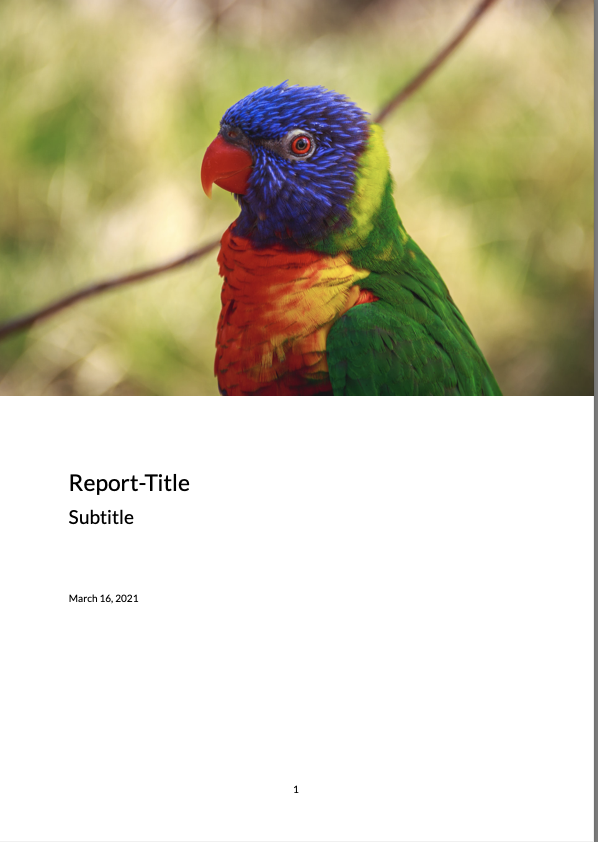

```{r, include = FALSE}
knitr::opts_chunk$set(
  collapse = TRUE,
  comment = "#>"
)
```

`vignette("intro")` has shown how to set up a package skeleton with indiedown. This article teaches you how to apply customizations to produce a template that fits your needs.


## Customization points

indiedown does not modify the default `.tex` template of Pandoc. Instead, all modifications are applied on top of it.
This should make it compliant with future releases of Pandoc and R Markdown.

There are three possible customization points to customize an indiedown skeleton:

- Set defaults (such as fonts or geometry) in the YAML header at `inst/indiedown/default.yaml`

- Tweak LaTeX settings at `inst/indiedown/preamble.tex`

- Apply dynamic adjustments in `pre_processor.R` (advanced)

For this tutorial, we will focus on the first two points only.

## `default.yaml`

Let's have a look at `inst/indedown/default.yaml`:

```yml
# indiedown: customize defaults in YAML header here

indent: false
compact-title: true
subparagraph: true  # needed for titlesec
papersize: a4
documentclass: article
secnumdepth: 2
fontsize: "11pt"

mainfont: regular.ttf
mainfontoptions:
- Path=<<indiedown_path>>/fonts/
- BoldFont=bold.ttf
- ItalicFont=italic.ttf
- BoldItalicFont=bolditalic.ttf
- Scale=0.92

linestretch: 1.05

geometry:
- top=2cm
- bottom=2cm
- left=2cm
- right=2cm
```

These are simply defaults for the custom template. So rather than adding these options to the YAML header of the `.Rmd` each time, they can be stored centrally.
You can overwrite these values in the `.Rmd` file.

It is recommended to set as many customizations as possible as Pandoc options, and fall back to LaTeX if this is not possible.
A full list of options is given in the [LaTeX section of the Pandoc manual](https://pandoc.org/MANUAL.html#variables-for-latex).

In our case, we want to use slightly wider page margins, so we change the geometry to:

```yml
geometry:
- top=2.5cm
- bottom=2.5cm
- left=3cm
- right=3cm
```

## Changing Fonts

Changing the font to fit your corporate style is usually the first step in customization.

Note that `<<indiedown_path>>` will be automatically substituted with the actual location of `inst/indiedown`. That is why we can include *assets* that are picked up by the template. The default template includes the free Roboto font, which is located at `inst/indiedown`.

We could replace that with a proprietary font to match the corporate design.
Instead we use a helper function to get one of [Google's free fonts](https://fonts.google.com).

use_indiedown_gfonts(id = "lato")

The function relies on the [gfonts](https://CRAN.R-project.org/package=gfonts) package to download and install the *Lato* font.
If you don't know the ID of a font, use `gfonts::get_all_fonts()` to get a list of all available fonts.

Let's preview what we have by now:

{ width=70% }


## `preamble.tex`

Let's turn to the second customization point, `preamble.tex`. This contains LaTeX code that is run at the beginning. Add everything here that cannot be changed in the `default.yaml`. We want to use slightly bigger headers, and change the `titlesec` line to:

```tex
\usepackage[medium]{titlesec}
```

As for `default.yaml`, it supports substitution of `<<indiedown_path>>`, so you could link to images here as well. Generally, you do not want do too many thing here.
Note that the default LaTeX title page is disabled in the default template, for good reason:

```tex
\renewcommand\maketitle{}
```

Instead, we will build our own title page in R now.

## A customized title page.

One of the core principles of indiedown is to keep corporate design elements as R code. That way, elements can be arranged flexibly and adjusted to particular needs.

As a final step, we build a customized title page by modifying the function definition of `R/cd_page_title`. The function writes LaTeX code that will be added to the `.Rmd` when `cd_page_title()` is called.

To make writing of LaTeX code in R easy, we rely on the raw string feature that was added in R 4.0.0. It allows you to write pure LaTeX code in R, without having to escape every `\` by a second `\\`.

If you have to use a version of R that is older, the `read_tex()` function offers an alternative way to write unescaped LaTeX code. See `?read_tex`.

The `indiedown_glue()` helper function uses the [glue](https://CRAN.R-project.org/package=glue) package to substitute variables in the string. That way, variables such as `title` or `subtitle` will be substituted in the LaTeX code.

With `indiedown_path_tex()`, you can also refer to the path of `inst/indiedown`, and use assets from the package. In the example, we use this to include a logo. Now, we don't want to use a logo but rather a photograph of a beautiful parrot. We download the image from [unsplash.com](https://unsplash.com/photos/gGC63oug3iY) in medium quality and store it in `res/mikhail-vasilyev-gGC63oug3iY-unsplash.jpg`. Then, we change the function definition as follows:

```r
cd_page_title <- function(title = default(rmarkdown::metadata$title, "Title"),
                          subtitle = default(rmarkdown::metadata$subtitle, "Subtitle"),
                          date = default(rmarkdown::metadata$date, cd_format_date(Sys.Date()))) {

  img_path <- indiedown_path_tex("res/mikhail-vasilyev-gGC63oug3iY-unsplash.jpg")

  indiedown_glue(
    # R >=4, raw strings allow to write LaTeX without escaping \ etc
    r"(

\vspace*{-3cm}

\begin{center}
\makebox[\textwidth]{\includegraphics[width=\paperwidth]{<<img_path>>}}
\end{center}

\vspace*{2cm}

\noindent \Huge <<title>>

\noindent \huge <<subtitle>>

\vspace*{2cm}

\normalsize

\noindent <<date>>

\clearpage
    )"
  )
}
```

Of course, we could also pass an image path as an argument, so we can choose a different title page in each report.

Building the package again, and running the template `.Rmd`, we get:

{ width=30% }

## Where to go from here

indiedown provides a framework to easily generate customized R Markdown templates. Templates can be customized by the full power of Pandoc and LaTeX through various points of customization.

This walk-through introduced two of them.
For more details and a description of the third one, see `vignette("customize")`.


